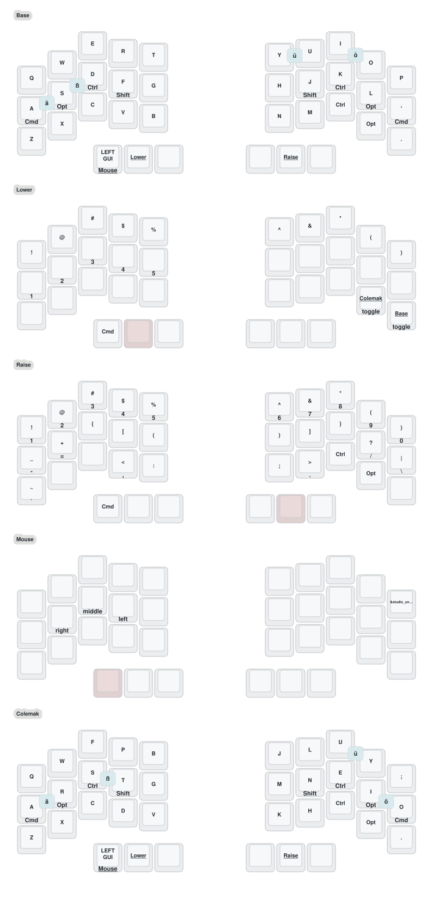

# crosses 36 — ZMK config

ZMK firmware config for the [crosses](https://github.com/Good-Great-Grand-Wonderful/gggw-zmk-keebs)
36-key split with two PMW3610 trackballs, running on nice!nano v2.

### Keymap


## Layers

| # | Name | Purpose |
|---|------|---------|
| 0 | Base | QWERTY alphas with home-row mods |
| 1 | Lower | Symbols, arrows, Bluetooth, layout toggle |
| 2 | Raise | Numbers + symbols (auto-shift: tap = number, hold = symbol) |
| 3 | Mouse | Mouse buttons, auto-activated by the right trackball |
| 4 | Colemak | Colemak Mod-DH alphas with home-row mods |

## Features

### Colemak Mod-DH (toggleable)
QWERTY is the default. Switch base layout from the **Lower** layer:
`&to 4` = Colemak, `&to 0` = QWERTY. Both base layers share the same
thumbs, mods, combos and home-row behaviour.

### Home-row mods (GACS)
Hold a home-row key for a modifier, tap for the letter. Positional
(`hold-trigger-key-positions`) so a mod only fires when the next key is on
the opposite hand — same-hand rolls stay clean.

| | Pinky | Ring | Middle | Index |
|---|---|---|---|---|
| Left  | Gui | Alt | Ctrl | Shift |
| Right | Shift | Ctrl | Alt | Gui |

Timing: `tapping-term 200ms`, `quick-tap 175ms`, `require-prior-idle 150ms`,
`balanced` flavor.

### German umlauts (combos)
Press two adjacent keys together. Output uses the macOS **U.S. International
PC** dead keys (`"` + vowel) and `AltGr+s` for ß, so set that input source.

| Umlaut | QWERTY | Colemak |
|--------|--------|---------|
| ä | A + S | A + R |
| ö | I + O | I + O |
| ü | Y + U | U + Y |
| ß | S + D | S + T |

### Trackballs
| | Left | Right |
|---|------|-------|
| Function | Scroll | Mouse cursor |
| CPI | 800 | 700 |

Moving the **right** trackball auto-activates the Mouse layer (layer 3) for
250 ms, so the mouse buttons (left-hand `LCLK`/`MCLK`/`RCLK`) are available
without holding a layer key. Trackball hardware/pins are defined in the
gggw shield; the listener override lives at the bottom of
`config/crosses.keymap`.

## Build & flash

The GitHub Actions workflow builds firmware on every push. Download the
`firmware` artifact from the latest run, then per half:

1. Plug the nice!nano in (a fresh board mounts as `NICENANO`; otherwise
   double-tap reset).
2. Copy the matching `.uf2` (`crosses_36_left.uf2` / `crosses_36_right.uf2`)
   onto the drive. The board reboots automatically.

Use the non-`internal_osc` artifacts — nice!nano v2 has an onboard 32 kHz
crystal. `settings_reset-*.uf2` clears Bluetooth bonds if needed.

## Regenerating the keymap drawing

```sh
./scripts/draw.sh
```

Runs keymap-drawer (via `uvx`) and writes `keymap-drawer/crosses.{yaml,svg}`.
The script post-processes the SVG to pure ASCII (umlauts as XML entities)
so the legends render correctly in any viewer.
